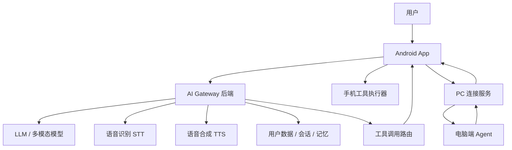
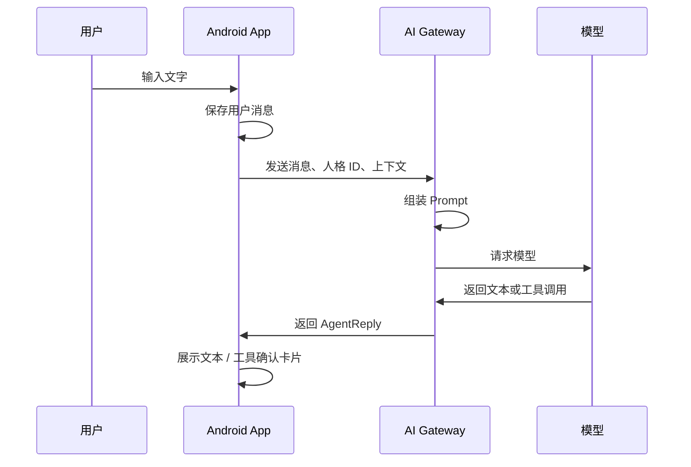

# Amaduse 个性化智能 Agent 对话 Android App 设计与分步开发计划

## 1. 项目定位

本项目目标是实现一个类似《命运石之门》中 Amadeus 概念的个性化智能 Agent Android App。它不是普通聊天机器人，而是一个具备人格、语音交互、多模态输入、工具调用、设备权限操作和电脑联动能力的私人智能助手。

核心体验：

- 用户可以通过文字、语音、摄像头与 Agent 对话。
- Agent 以用户设置的人格、语气、表达风格进行纯文本或语音回答。
- Agent 可以在用户授权后执行简单手机任务，例如设置闹钟、记录备忘录、打开 App、回复通知消息。
- Agent 可以连接用户电脑，向电脑发布任务并接收结果。
- Agent 逐步积累用户偏好、常用称呼、语气偏好和长期记忆。

## 2. 当前项目现状

当前项目已迁移为基础 Kotlin + Jetpack Compose Android 工程：

- 项目名：`amaduse`
- 包名：`com.sg.amaduse`
- 当前语言：Kotlin
- 当前 UI：Jetpack Compose
- 当前构建：Gradle Kotlin DSL
- 当前 `minSdk`：26
- 当前 `targetSdk`：36

### 2.1 技术路线选择

有两种可行路线。

#### 路线 A：沿用 Java + XML 快速做原型

优点：

- 改动小，可以直接在当前项目上继续开发。
- 入门门槛低。
- 适合先验证聊天链路、权限操作和 PC 联动。

缺点：

- 后续做复杂聊天 UI、状态管理、多模块架构会更累。
- 现代 Android 示例、库和社区方案更多偏 Kotlin。

#### 路线 B：迁移到 Kotlin + Jetpack Compose

优点：

- 更适合构建聊天 App、动态状态界面、权限弹窗、工具确认卡片。
- 协程、Flow、Room、DataStore、Ktor 等生态配合更自然。
- 长期维护成本更低。

缺点：

- 初期需要调整工程配置。
- 如果还不熟悉 Kotlin/Compose，学习成本更高。

建议：

- 如果目标是认真做成长期项目，建议先迁移到 Kotlin + Compose。
- 如果目标是先跑通原型，可以先用 Java/XML 做 MVP，但后续仍建议迁移。

## 3. 功能范围

### 3.1 必做功能

- 文字聊天
- 语音输入
- 文本回答
- 语音回答
- 个性化人格设置
- 会话历史保存
- App 内备忘录
- 设置闹钟
- 摄像头拍照输入
- 手机端工具调用确认
- 电脑端连接与任务发送

### 3.2 后续增强功能

- 长期记忆
- 角色模板市场
- 多人格切换
- 多模态图片理解
- 通知消息快捷回复
- 短信辅助回复
- 日程管理
- App 自动化操作
- PC 文件操作
- PC 浏览器操作
- 跨网络远程连接
- 本地小模型或混合推理

### 3.3 暂不建议第一版实现的功能

- 未经确认自动发送短信
- 未经确认自动回复第三方聊天软件
- 直接执行任意电脑命令
- 未经授权模拟真实声优或真人声音
- 直接完整复刻受版权保护的动漫角色人格和台词库

## 4. 总体架构



### 4.1 Android App 职责

- 展示聊天 UI。
- 采集文字、语音、图片输入。
- 播放文本转语音结果。
- 保存本地会话缓存。
- 显示工具调用确认卡片。
- 执行手机端工具。
- 管理 Android 权限。
- 与 PC Agent 建立连接。

### 4.2 AI Gateway 后端职责

- 保存模型 API Key，避免暴露在 App 内。
- 统一调用大模型、多模态模型、STT、TTS。
- 拼装系统提示词、人格卡、历史消息和长期记忆。
- 解析模型输出。
- 生成工具调用请求。
- 对敏感工具调用做安全校验。
- 管理用户账号、设备、会话和记忆。

### 4.3 PC Agent 职责

- 在用户电脑上常驻运行。
- 与手机或后端建立安全连接。
- 接收白名单任务。
- 执行电脑端能力。
- 返回任务状态和结果。

## 5. 推荐技术栈

### 5.1 Android

推荐正式路线：

- Kotlin
- Jetpack Compose
- MVVM / MVI
- Kotlin Coroutines
- Flow / StateFlow
- Room
- DataStore
- Retrofit 或 Ktor Client
- CameraX
- Android SpeechRecognizer
- Android TextToSpeech
- WorkManager
- NotificationListenerService

当前项目如果继续使用 Java/XML：

- AppCompat
- Material Components
- RecyclerView
- ViewModel + LiveData
- Room
- Retrofit
- CameraX
- SpeechRecognizer
- TextToSpeech

### 5.2 后端

推荐其中一种：

- Node.js + NestJS
- Node.js + Fastify
- Python + FastAPI
- Kotlin + Ktor

建议第一版使用：

- FastAPI 或 Node.js Fastify
- PostgreSQL 或 SQLite
- Redis 可选
- WebSocket 支持流式回复和 PC 联动

### 5.3 PC Agent

推荐：

- Node.js：适合快速调用系统、WebSocket、桌面自动化。
- Python：适合自动化脚本、文件处理、AI 工具集成。
- Rust / Go：适合长期后台服务和安全发布。

第一版建议用 Node.js 或 Python。

## 6. Android 模块设计

建议正式版模块划分：

```text
app/
  core/
    network/
    database/
    permissions/
    audio/
    camera/
    security/
  feature/
    chat/
    persona/
    memory/
    tools/
    settings/
    pcbridge/
  data/
    repository/
    model/
    local/
    remote/
  domain/
    usecase/
    entity/
```

如果保持单 `app` 模块，也建议按 package 分层：

```text
com.sg.amaduse
  ui.chat
  ui.persona
  ui.settings
  data.local
  data.remote
  data.repository
  domain.model
  domain.usecase
  agent.tool
  agent.persona
  agent.memory
  device.audio
  device.camera
  device.permissions
  pcbridge
```

## 7. 核心数据模型

### 7.1 聊天消息

```json
{
  "id": "msg_001",
  "conversationId": "conv_001",
  "role": "user",
  "contentType": "text",
  "text": "明早七点半叫我起床",
  "imageUris": [],
  "audioUri": null,
  "createdAt": 1780000000000
}
```

角色类型：

- `user`
- `assistant`
- `system`
- `tool`

内容类型：

- `text`
- `audio`
- `image`
- `mixed`

### 7.2 人格卡

```json
{
  "id": "persona_default_calm",
  "name": "冷静观察者",
  "description": "冷静、理性、稍带关心的助手人格",
  "tone": "冷静、直接、克制",
  "addressingUser": "研究员",
  "speakingStyle": [
    "先给结论，再解释",
    "句子偏短",
    "避免过度热情",
    "偶尔轻微吐槽"
  ],
  "boundaries": [
    "不冒充真实人物",
    "不输出未经授权的版权台词",
    "敏感操作必须请求确认"
  ],
  "systemPrompt": "你是一个冷静、理性、略带关心的私人智能助手..."
}
```

### 7.3 工具调用

```json
{
  "id": "tool_call_001",
  "name": "set_alarm",
  "args": {
    "date": "2026-05-30",
    "hour": 7,
    "minute": 30,
    "label": "起床"
  },
  "riskLevel": "medium",
  "requiresConfirmation": true,
  "status": "pending"
}
```

风险等级：

- `low`：只读、无外部影响，例如查询本地备忘录。
- `medium`：修改本机状态，例如设置闹钟、创建备忘录。
- `high`：对外发送信息或执行外部动作，例如回复消息、发送短信、电脑执行脚本。

## 8. 对话链路设计

### 8.1 文字对话流程



### 8.2 语音输入流程

第一版建议：

```text
录音 -> Android SpeechRecognizer -> 文本 -> 正常聊天链路
```

后续增强：

```text
录音 -> 上传后端 -> STT -> 文本 -> 正常聊天链路
```

### 8.3 语音回答流程

第一版建议：

```text
模型文本回复 -> Android TextToSpeech -> 播放
```

后续增强：

```text
模型文本回复 -> 后端 TTS -> 音频 URL/字节流 -> Android 播放
```

### 8.4 摄像头输入流程

```text
CameraX 拍照
  -> 图片压缩
  -> 上传后端
  -> 多模态模型理解图片
  -> 与用户问题一起生成回复
```

## 9. 工具调用系统设计

### 9.1 工具调用原则

- 模型只负责“提出工具调用意图”，不直接执行。
- Android 或 PC Agent 才是真正执行工具的一方。
- 所有中高风险工具必须显示确认卡片。
- 工具参数必须结构化，不能只靠自然语言。
- 工具执行结果要回写到会话中，让模型继续生成自然语言总结。

### 9.2 手机端工具白名单

第一阶段：

- `set_alarm`：设置闹钟。
- `create_note`：创建 App 内备忘录。
- `list_notes`：查看 App 内备忘录。
- `open_app`：打开指定 App。
- `open_url`：打开网页。

第二阶段：

- `create_calendar_event`：创建日程。
- `read_notifications`：读取通知摘要。
- `reply_notification`：通过通知快捷回复。
- `draft_sms`：生成短信草稿。

第三阶段：

- `send_sms`：发送短信，仅在用户明确确认后执行。
- `call_phone`：拨号或呼叫，仅在用户明确确认后执行。
- `device_automation`：有限的设备自动化。

### 9.3 工具确认 UI

确认卡片应显示：

- 工具名称。
- 关键参数。
- 风险说明。
- 执行对象。
- 确认按钮。
- 取消按钮。

示例：

```text
Agent 想执行：
设置闹钟

时间：2026-05-30 07:30
标签：起床

[确认执行] [取消]
```

### 9.4 工具执行状态

```text
pending -> confirmed -> running -> success
pending -> cancelled
running -> failed
```

## 10. Android 权限设计

### 10.1 权限清单

可能需要的权限：

- `RECORD_AUDIO`：语音输入。
- `CAMERA`：摄像头输入。
- `POST_NOTIFICATIONS`：通知展示。
- `SCHEDULE_EXACT_ALARM`：精确闹钟，具体取决于实现方式。
- `READ_CALENDAR` / `WRITE_CALENDAR`：日程。
- `READ_CONTACTS`：联系人匹配，可选。
- `SEND_SMS`：发送短信，高风险。
- `READ_SMS`：读取短信，高风险，审核严格。
- `BIND_NOTIFICATION_LISTENER_SERVICE`：通知监听，需要用户手动授权。

### 10.2 权限策略

- 不在首次启动时一次性申请全部权限。
- 用户触发功能时再申请对应权限。
- 每个敏感权限都要解释用途。
- 权限拒绝后提供降级方案。
- 高风险权限默认关闭。

### 10.3 功能与权限关系

| 功能 | 权限 | 风险 | 第一版建议 |
| --- | --- | --- | --- |
| 文字聊天 | 无 | 低 | 实现 |
| 语音输入 | `RECORD_AUDIO` | 中 | 实现 |
| 语音播放 | 通常无 | 低 | 实现 |
| 摄像头输入 | `CAMERA` | 中 | 实现 |
| 设置闹钟 | 可用 Intent | 中 | 实现 |
| App 内备忘录 | 无 | 低 | 实现 |
| 日程 | Calendar 权限 | 中 | 后续 |
| 通知回复 | 通知监听 | 高 | 后续 |
| 短信发送 | SMS 权限 | 高 | 后续谨慎实现 |

## 11. 人格与角色系统设计

### 11.1 人格卡结构

人格卡由以下部分组成：

- 名称
- 简介
- 语气
- 称呼用户方式
- 回答长度偏好
- 情绪表达强度
- 说话习惯
- 禁止事项
- 工具调用风格
- 系统 Prompt

### 11.2 动漫角色风格

建议实现为“风格启发模板”，而不是完整复制角色。

可以支持：

- 冷静科学家风格
- 元气少女风格
- 毒舌但关心风格
- 温柔姐姐风格
- 严谨执事风格
- 沉着指挥官风格

避免：

- 声称自己就是某个受版权保护角色。
- 大量复刻角色原台词。
- 克隆声优或真人声音。

### 11.3 长期记忆

第一版只保存显式记忆：

```text
用户手动说：“记住我喜欢晚上写代码。”
Agent 询问确认。
用户确认。
写入长期记忆。
```

后续再做自动总结记忆。

记忆类型：

- 用户称呼
- 喜欢的语气
- 作息偏好
- 常用设备
- 常用联系人
- 常用任务
- 禁忌话题

## 12. 后端 API 设计

### 12.1 发送聊天消息

```http
POST /api/v1/chat/send
```

请求：

```json
{
  "conversationId": "conv_001",
  "personaId": "persona_default_calm",
  "message": {
    "type": "text",
    "text": "明早七点半叫我起床"
  },
  "clientContext": {
    "timezone": "Asia/Shanghai",
    "device": "android",
    "availableTools": ["set_alarm", "create_note", "open_app"]
  }
}
```

响应：

```json
{
  "reply": {
    "text": "可以。我准备帮你设置明早 7:30 的闹钟。",
    "speak": true
  },
  "toolCalls": [
    {
      "id": "tool_call_001",
      "name": "set_alarm",
      "args": {
        "date": "2026-05-30",
        "hour": 7,
        "minute": 30,
        "label": "起床"
      },
      "riskLevel": "medium",
      "requiresConfirmation": true
    }
  ]
}
```

### 12.2 上传图片

```http
POST /api/v1/media/image
```

响应：

```json
{
  "imageId": "img_001",
  "url": "https://server/media/img_001.jpg"
}
```

### 12.3 语音识别

```http
POST /api/v1/audio/transcribe
```

响应：

```json
{
  "text": "帮我看看这张图里是什么"
}
```

### 12.4 语音合成

```http
POST /api/v1/audio/speech
```

响应：

```json
{
  "audioUrl": "https://server/audio/tts_001.mp3"
}
```

### 12.5 工具执行结果回传

```http
POST /api/v1/tools/result
```

请求：

```json
{
  "toolCallId": "tool_call_001",
  "status": "success",
  "result": {
    "message": "闹钟已设置"
  }
}
```

## 13. PC 联动设计

### 13.1 第一版连接方式

第一版建议局域网 WebSocket：

```text
Android App -> ws://电脑局域网 IP:端口
```

PC Agent 启动后显示：

- 当前局域网 IP
- 端口
- 配对二维码
- 设备名称

手机扫码后保存：

- PC 设备 ID
- 地址
- 共享密钥

### 13.2 后续远程连接方式

后续可以支持：

- 后端中转 WebSocket
- Tailscale / ZeroTier 虚拟局域网
- MQTT
- WebRTC DataChannel

### 13.3 PC Agent 白名单工具

第一版：

- `pc_open_url`
- `pc_open_app`
- `pc_show_message`
- `pc_get_status`
- `pc_run_preset_script`

第二版：

- `pc_create_file`
- `pc_read_allowed_file`
- `pc_search_files`
- `pc_screenshot`
- `pc_browser_task`

不建议第一版支持：

- 任意 shell 命令。
- 任意文件读写。
- 自动输入密码。
- 绕过系统权限。

### 13.4 PC 任务协议

```json
{
  "id": "pc_task_001",
  "type": "pc_open_url",
  "args": {
    "url": "https://example.com"
  },
  "createdAt": 1780000000000,
  "signature": "..."
}
```

响应：

```json
{
  "id": "pc_task_001",
  "status": "success",
  "message": "已打开网页"
}
```

## 14. 安全与隐私设计

### 14.1 API Key 安全

- 模型 API Key 不应写入 Android App。
- Android App 只访问自己的后端。
- 后端负责调用模型服务。
- 后端可按用户、设备、频率做限制。

### 14.2 敏感操作确认

以下操作必须确认：

- 发短信。
- 回复消息。
- 创建或修改日程。
- 删除数据。
- 执行 PC 脚本。
- 打开外部链接。
- 读取联系人、短信、通知。

### 14.3 本地数据

- 聊天记录可存在 Room。
- 敏感配置存在 EncryptedSharedPreferences 或 Android Keystore。
- 长期记忆支持用户查看和删除。
- 提供“清空全部数据”入口。

### 14.4 审计日志

建议记录工具执行日志：

- 工具名。
- 参数摘要。
- 执行时间。
- 执行状态。
- 用户是否确认。

## 15. UI 设计建议

### 15.1 主界面

主界面直接是聊天界面，不做营销式首页。

必要区域：

- 顶部：当前人格、连接状态、设置入口。
- 中部：消息列表。
- 底部：输入框、语音按钮、相机按钮、发送按钮。
- 工具调用确认卡：插入聊天流中。

### 15.2 设置页

设置页包含：

- 当前人格。
- 语音开关。
- TTS 音色。
- 长期记忆。
- 权限管理。
- PC 连接管理。
- 数据清理。

### 15.3 人格编辑页

字段：

- 名称。
- 简介。
- 用户称呼。
- 语气。
- 回复长度。
- 情绪强度。
- 说话习惯。
- 禁止事项。

## 16. 分步开发计划

### 阶段 0：工程准备

目标：确定技术路线，整理工程基础。

任务：

- 决定继续 Java/XML 还是迁移 Kotlin/Compose。
- 调整 `minSdk`，除非只面向最新设备，否则不建议保持 36。
- 建立基础包结构。
- 接入 ViewModel、Room、Retrofit 或 Ktor。
- 配置基础主题、图标和启动页。

验收标准：

- App 可以正常编译运行。
- 主界面可以打开。
- 基础依赖配置完成。

### 阶段 1：文字聊天 MVP

目标：完成最小对话闭环。

任务：

- 实现聊天消息列表。
- 实现文本输入和发送。
- 建立 `ChatRepository`。
- 接入后端 `/chat/send`。
- 显示模型返回文本。
- 本地保存聊天记录。

验收标准：

- 用户输入文本后可以得到 Agent 文本回复。
- 退出重进 App 后聊天记录仍存在。
- 网络失败时有明确错误提示。

### 阶段 2：人格卡系统

目标：让回复具备可配置个性。

任务：

- 建立人格卡数据模型。
- 内置 3 到 5 个基础人格。
- 实现人格选择页。
- 实现人格编辑页。
- 请求后端时带上 `personaId`。
- 后端根据人格卡拼接系统提示词。

验收标准：

- 不同人格会明显影响语气。
- 用户可以创建、编辑、删除自定义人格。
- 人格配置会持久化。

### 阶段 3：语音输入与语音回答

目标：支持基础语音交互。

任务：

- 申请 `RECORD_AUDIO` 权限。
- 接入 Android `SpeechRecognizer`。
- 将识别结果填入输入框或直接发送。
- 接入 Android `TextToSpeech`。
- 为每条 Agent 回复提供播放按钮。
- 设置页增加语音自动播放开关。

验收标准：

- 用户可以按住或点击麦克风进行语音输入。
- 识别文本可以发送。
- Agent 回复可以被朗读。
- 权限拒绝时 App 不崩溃。

### 阶段 4：摄像头与图片输入

目标：支持拍照提问。

任务：

- 申请 `CAMERA` 权限。
- 接入 CameraX。
- 支持拍照并显示预览。
- 图片压缩后上传后端。
- 聊天请求携带 `imageId`。
- 后端调用多模态模型生成回答。

验收标准：

- 用户可以拍照并提问。
- Agent 可以基于图片内容回答。
- 图片上传失败时有重试或错误提示。

### 阶段 5：手机工具调用框架

目标：建立 Agent 执行手机任务的基础能力。

任务：

- 定义 `ToolCall` 数据模型。
- 定义工具执行器接口。
- 实现工具确认卡片 UI。
- 实现工具状态流转。
- 实现 `set_alarm`。
- 实现 `create_note`。
- 实现 `open_url`。
- 将工具执行结果回传后端。

验收标准：

- 用户说“明早七点半叫我”时，App 显示闹钟确认卡。
- 用户确认后可以打开系统闹钟设置或直接设置。
- 用户可以让 Agent 创建 App 内备忘录。
- 所有工具执行都有成功/失败反馈。

### 阶段 6：后端 AI Gateway

目标：让模型调用、人格、记忆、工具协议稳定运行。

任务：

- 建立后端项目。
- 实现用户/设备基础标识。
- 实现 `/chat/send`。
- 实现 Prompt 组装。
- 实现工具 schema。
- 实现模型输出解析。
- 实现聊天历史裁剪。
- 实现基础限流和错误处理。

验收标准：

- Android 不直接保存模型 API Key。
- 后端可以稳定返回文本和工具调用。
- 模型输出异常时后端能兜底。

### 阶段 7：长期记忆

目标：让 Agent 记住用户明确授权的信息。

任务：

- 建立记忆数据模型。
- 支持“记住/忘记”指令。
- 敏感记忆写入前要求确认。
- 设置页展示记忆列表。
- 用户可删除单条记忆。
- Prompt 中注入相关记忆。

验收标准：

- 用户明确要求记住的信息会在后续对话中生效。
- 用户可以查看和删除记忆。
- Agent 不会在未确认时写入敏感长期记忆。

### 阶段 8：PC Agent MVP

目标：手机可以向电脑发送简单任务。

任务：

- 实现 PC Agent WebSocket 服务。
- 显示配对二维码。
- Android 实现扫码或手动输入 IP/端口。
- 建立共享密钥。
- 实现 `pc_open_url`。
- 实现 `pc_show_message`。
- 实现 `pc_get_status`。
- 实现连接状态显示。

验收标准：

- 手机和电脑在同一局域网下可以配对。
- 用户可以让 Agent 在电脑上打开网页。
- 电脑执行结果会回到手机聊天界面。
- 未配对设备不能发送任务。

### 阶段 9：通知与消息回复

目标：支持受控的消息辅助回复。

任务：

- 引导用户开启通知访问权限。
- 读取通知摘要。
- 检测支持 `RemoteInput` 的通知。
- 让 Agent 生成回复草稿。
- 用户确认后通过通知快捷回复。
- 记录回复日志。

验收标准：

- App 能显示可回复通知。
- Agent 能生成符合人格的回复草稿。
- 用户确认后才发送。
- 不支持快捷回复的 App 有降级提示。

### 阶段 10：短信与日程增强

目标：扩展高风险工具，但保持可控。

任务：

- 实现短信草稿。
- 研究默认短信 App 限制。
- 实现用户确认后跳转系统短信界面。
- 实现日程创建。
- 增加联系人选择。
- 增加高风险权限说明页。

验收标准：

- 短信默认以草稿或系统确认界面方式发送。
- 日程创建需要用户确认。
- 权限被拒绝时有替代方案。

### 阶段 11：体验优化

目标：让 App 从“能用”变成“顺手”。

任务：

- 流式回复。
- 回复打字动画。
- 语音播放状态。
- 失败重试。
- 离线提示。
- 聊天搜索。
- 人格快速切换。
- 工具执行历史。
- PC 在线状态。

验收标准：

- 常用操作不需要多余步骤。
- 错误状态可理解。
- 复杂任务有清晰确认流程。

### 阶段 12：发布准备

目标：让项目具备可测试、可分发基础。

任务：

- 单元测试。
- UI 测试。
- 后端接口测试。
- 权限说明文档。
- 隐私政策。
- 崩溃收集。
- 日志脱敏。
- Release 构建。

验收标准：

- App 可以生成 Release APK。
- 常见权限场景测试通过。
- 敏感数据不会进入普通日志。
- 用户可以清除个人数据。

## 17. 里程碑建议

### v0.1：文字聊天原型

- 文本聊天。
- 本地聊天记录。
- 一个默认人格。
- 后端文本回复。

### v0.2：人格与语音

- 人格选择和编辑。
- 语音输入。
- 语音播报。

### v0.3：图片与工具

- 摄像头拍照输入。
- 设置闹钟。
- App 内备忘录。
- 工具确认卡。

### v0.4：PC 联动

- 局域网配对。
- 打开电脑网页。
- 查询电脑状态。
- 电脑显示消息。

### v0.5：记忆系统

- 显式长期记忆。
- 记忆查看和删除。
- 根据记忆调整回复。

### v0.6：通知回复

- 通知读取。
- 回复草稿。
- 用户确认后快捷回复。

### v1.0：可用版本

- 稳定聊天。
- 稳定人格系统。
- 语音输入输出。
- 图片输入。
- 基础手机工具。
- 基础 PC 工具。
- 权限和隐私说明完整。

## 18. 测试计划

### 18.1 Android 单元测试

覆盖：

- 消息数据模型。
- 人格卡解析。
- 工具调用解析。
- 工具风险等级判断。
- Repository 错误处理。

### 18.2 Android UI 测试

覆盖：

- 发送消息。
- 切换人格。
- 工具确认卡。
- 权限拒绝。
- 语音开关。

### 18.3 后端测试

覆盖：

- `/chat/send` 正常响应。
- 模型异常兜底。
- 工具调用 JSON 校验。
- Prompt 注入防护。
- 限流。

### 18.4 PC Agent 测试

覆盖：

- 配对流程。
- 非法签名拒绝。
- 白名单任务执行。
- 断线重连。
- 任务超时。

## 19. 风险与应对

| 风险 | 影响 | 应对 |
| --- | --- | --- |
| 模型 API Key 泄露 | 高 | 只放后端，不放 App |
| 工具误执行 | 高 | 中高风险操作必须确认 |
| 短信权限限制 | 高 | 第一版只做草稿或系统跳转 |
| 第三方消息回复不稳定 | 中 | 优先使用通知 RemoteInput |
| 角色版权问题 | 中 | 使用风格启发模板 |
| 声音侵权 | 高 | 不克隆真人/声优声音 |
| PC 任意命令风险 | 高 | 白名单任务，不开放任意 shell |
| 长期记忆误存隐私 | 高 | 显式确认，用户可查看删除 |

## 20. 第一周开发建议

如果从今天开始做，第一周建议只完成 v0.1。

第 1 天：

- 确定 Java/XML 还是 Kotlin/Compose。
- 调整工程基础配置。
- 搭建主聊天页面。

第 2 天：

- 实现消息列表。
- 实现输入框和发送按钮。
- 建立本地消息模型。

第 3 天：

- 建立后端最小服务。
- 实现 `/chat/send` mock 响应。
- Android 接入后端。

第 4 天：

- 接入真实模型。
- 加入默认人格 Prompt。
- 完成错误处理。

第 5 天：

- 接入 Room 保存聊天记录。
- 支持重新进入恢复会话。

第 6 天：

- 优化 UI。
- 增加加载状态、失败重试。
- 整理基础代码结构。

第 7 天：

- 做一次端到端测试。
- 写 README。
- 规划 v0.2。

## 21. 最小实现清单

真正开始写代码时，先完成以下文件或模块：

Android：

- `ChatActivity` 或 `MainActivity`
- `ChatViewModel`
- `ChatRepository`
- `ChatMessage`
- `AgentReply`
- `Persona`
- `ToolCall`
- `ApiService`
- `LocalDatabase`

后端：

- `POST /api/v1/chat/send`
- `PersonaPromptBuilder`
- `ToolSchema`
- `ModelClient`
- `ConversationStore`

PC Agent：

- `WebSocketServer`
- `PairingService`
- `TaskRouter`
- `OpenUrlTool`
- `ShowMessageTool`

## 22. 推荐下一步

建议下一步先做以下决策：

1. 是否把当前项目迁移到 Kotlin + Compose。
2. 后端用 Node.js 还是 Python。
3. 第一版模型服务用哪家 API。
4. 第一版是否需要账号系统，还是先单用户本地设备绑定。
5. PC Agent 第一版用 Node.js 还是 Python。

在这些决策确定后，就可以开始 v0.1 的代码实现。
