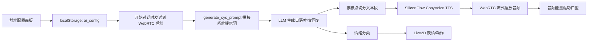

# 牧濑红莉栖语音、语气、语调生成逻辑说明

来源项目：`E:\2025llm\amadeus-system-new`

本文档总结 Amadeus System New Alpha 中与“牧濑红莉栖”角色还原相关的核心逻辑。这里的“还原”由三部分共同完成：

- 语气/说话风格：由 LLM 系统提示词控制。
- 音色/语调：由 SiliconFlow 的 CosyVoice TTS voice id 或参考音频克隆控制。
- 表情/动作氛围：由 Live2D 模型、情绪分类和口型动画控制。

## 1. 总体链路



## 2. 角色语气生成

核心文件：

- `service/webrtc/server.py`
- `service/webrtc/utils/prompt_utils.py`
- `src/components/ConfigPanel/useConfigPanel.ts`
- `src/components/ConfigPanel/index.tsx`

默认角色提示词出现在前端和后端两处：

```text
命运石之门(steins gate)的牧濑红莉栖(kurisu),一个天才少女,性格傲娇,不喜欢被叫克里斯蒂娜
```

后端默认值位于：

- `service/webrtc/server.py:53`

前端默认值位于：

- `src/components/ConfigPanel/useConfigPanel.ts:35`
- `src/components/ConfigPanel/index.tsx:26`

真正送给 LLM 的完整系统提示词由 `generate_sys_prompt()` 生成，位置：

- `service/webrtc/utils/prompt_utils.py:26`

该函数会把用户配置的 `system_prompt` 包进：

```text
<Personality>{system_prompt}</Personality>
```

同时附加：

- 输出语言：`<Output_language>日文/中文/英文</Output_language>`
- 输出风格：像真实人类实时语音交谈
- 角色名映射：包含 `牧濑红莉栖(kurisu)`、`冈部伦太郎(okabe)` 等
- 当前用户名称
- 当前时间
- 自主发起对话能力

因此，“像不像牧濑红莉栖”的语言层主要由 `system_prompt` 和 `generate_sys_prompt()` 决定。

## 3. 语言输出策略

默认语言配置：

- `service/webrtc/server.py:51`：`DEFAULT_VOICE_OUTPUT_LANGUAGE = 'ja'`
- `service/webrtc/server.py:52`：`DEFAULT_TEXT_OUTPUT_LANGUAGE = 'zh'`
- `src/components/ConfigPanel/useConfigPanel.ts:65`：前端默认语音输出 `ja`
- `src/components/ConfigPanel/useConfigPanel.ts:66`：前端默认文本输出 `zh`

这表示默认流程是：

1. LLM 按日语生成适合 TTS 的文本。
2. TTS 使用日语文本生成语音。
3. 如果文本显示语言和语音语言不同，前端显示侧会拿到翻译后的中文。

文本分段和翻译逻辑在：

- `service/webrtc/utils/stream_utils.py`

关键点：

- `split_text_by_punctuation()` 按标点切段，减少 TTS 等待。
- `process_llm_stream()` 一边接收 LLM 流式文本，一边把分段提交给 TTS。
- 当 `voice_output_language != text_output_language` 时，会调用 `translate_text()` 做文本展示翻译。

## 4. 音色与语调生成

核心文件：

- `service/webrtc/tts/speech.py`
- `service/webrtc/utils/stream_utils.py`
- `service/webrtc/server.py`
- `src/components/ConfigPanel/VoiceCloneModal.tsx`
- `service/src/services/voiceCloneService.ts`
- `service/src/routes/voiceCloneRoutes.ts`

TTS 默认 voice id：

```text
speech:siliconflow-kurisu:clzv7bjjm041fufyct2z0setm:mphrsbbmvrjfophbsted
```

位置：

- `service/webrtc/tts/speech.py:20`

TTS 调用接口：

- `service/webrtc/tts/speech.py:85`

请求参数核心字段：

```python
data = {
    'model': 'FunAudioLLM/CosyVoice2-0.5B',
    'input': text,
    'voice': voice,
    'sample_rate': sample_rate,
    'response_format': 'pcm',
}
```

实际请求地址：

```text
https://api.siliconflow.cn/v1/audio/speech
```

因此，“音色/语调”的主要决定因素是：

- `voice`：SiliconFlow voice id。
- `input`：LLM 生成的日语文本内容、标点、语气词。
- `model`：当前固定为 `FunAudioLLM/CosyVoice2-0.5B`。
- 参考音频克隆质量：由上传的音频和参考文本决定。

当前代码没有直接设置 pitch、speed、emotion 等细粒度 TTS 参数，语调主要依赖 CosyVoice 模型根据 `voice` 与输入文本自动生成。

## 5. 参考语音与语音克隆

预设参考声音定义在：

- `src/components/ConfigPanel/VoiceCloneModal.tsx:28`

预设项：

```ts
{
  id: 'voice_kurisu',
  name: '牧濑红莉栖',
  audioUrl: 'https://file.amadeus-web.top/d/%E7%BA%A2%E8%8E%89%E6%A0%96.wav',
  referenceText: 'ふんよくも私の正体を聞けたものだ...'
}
```

注意：远程文件名是 `.wav`，但下载后文件头是 `FF FB...`，实际更像 MP3。已在本地保存为：

```text
E:\2025llm\amadeus-system-new\public\voices\kurisu-reference.mp3
```

前端静态路径：

```text
/voices/kurisu-reference.mp3
```

语音克隆流程：

1. 前端点击“语音克隆”。
2. `VoiceCloneModal.tsx` 调用 `/node/api/voice-clone/clone-from-url`。
3. Node 服务 `voiceCloneRoutes.ts` 接收请求。
4. `voiceCloneService.ts` 下载参考音频并转 base64。
5. 调用 SiliconFlow `/uploads/audio/voice` 上传音频、参考文本、模型名、自定义名称。
6. SiliconFlow 返回新的 voice uri。
7. 前端把返回的 voice uri 写入 `aiConfig.siliconflow_voice`。
8. 开始对话时，该 voice id 发送到 WebRTC 后端。
9. 后端 TTS 使用该 voice id 生成角色语音。

相关位置：

- `src/components/ConfigPanel/VoiceCloneModal.tsx:134`
- `service/src/routes/voiceCloneRoutes.ts:8`
- `service/src/services/voiceCloneService.ts:44`
- `service/src/services/voiceCloneService.ts:88`
- `src/components/ConfigPanel/useConfigPanel.ts:458`

## 6. 前端配置到后端的传递

前端配置保存在：

```text
localStorage.ai_config
```

保存逻辑：

- `src/components/ConfigPanel/useConfigPanel.ts:297`

开始对话时，`src/pages/Home/index.tsx` 会读取该配置。

如果使用内置服务：

- 调用 `/use_builtin_service`
- 后端从环境变量读取 API key、voice id 等

如果使用自定义服务：

- 调用 `/input_hook`
- 前端把 `llm_api_key`、`siliconflow_api_key`、`siliconflow_voice`、`system_prompt` 等传给后端

后端配置模型：

- `service/webrtc/routes.py:13`

后端保存配置：

- `service/webrtc/routes.py:133`
- `service/webrtc/routes.py:149`

后端读取当前用户 voice：

- `service/webrtc/server.py:158`

## 7. LLM 到 TTS 的流式处理

核心函数：

- `service/webrtc/utils/stream_utils.py:265`

流程：

1. `ai_stream()` 从 LLM 获取流式文本。
2. `split_text_by_punctuation()` 将文本按标点切分。
3. 每个完整片段提交给 `_tts_pool` 线程池。
4. `run_tts_in_thread()` 调用 `text_to_speech_stream(segment, voice=voice)`。
5. TTS 返回 PCM 音频块。
6. 音频块通过 WebRTC 流式传给前端播放。
7. 完整回复结束后，做情绪分析并发送 `emotion_response`。

关键位置：

- `service/webrtc/utils/stream_utils.py:386`
- `service/webrtc/utils/stream_utils.py:388`
- `service/webrtc/utils/stream_utils.py:489`
- `service/webrtc/tts/speech.py:85`

## 8. 情绪、表情与口型

情绪分析：

- `service/webrtc/ai/emotion.py`

支持的情绪枚举：

```text
neutral, anger, joy, sadness, shy, shy2, smile1, smile2, unhappy
```

情绪结果通过 SSE 发给前端：

- `service/webrtc/utils/stream_utils.py:494`
- `src/hooks/useWebRTC.ts:472`

前端收到情绪后更新 Live2D：

- `src/pages/Home/index.tsx:134`
- `src/pages/Home/index.tsx:137`
- `src/pages/Home/index.tsx:138`

Live2D 表情设置：

- `src/components/Live2dModel/index.tsx:110`
- `src/components/Live2dModel/index.tsx:116`

Live2D 模型地址：

- `src/constants/live2d.ts:12`

```text
https://static.amadeus-web.top/live2dmodels/steinsGateKurisuNew/红莉栖.model3.json
```

口型动画不是 TTS 模型直接输出，而是前端根据播放出来的远端音频能量计算嘴部开合：

- `src/hooks/useWebRTC.ts:263`

## 9. 本地未发现的数据集

本项目中没有发现本地打包的 Kurisu 专用训练集，例如：

- 台词语料 `.jsonl/.csv/.txt`
- 声音数据集 `.wav/.mp3/.flac` 批量文件
- 声音模型权重 `.ckpt/.safetensors/.pth`

目前本地相关资源只有：

- `public/voices/kurisu-reference.mp3`：从远程预设参考音频下载得到。
- `public/silero_vad.onnx`：语音活动检测模型，不是角色音色模型。

因此当前项目不是本地训练式方案，而是：

```text
Prompt 控制角色语气 + SiliconFlow voice id/参考音频控制音色 + Live2D 控制视觉表情
```

## 10. 若迁移到 Android 项目应保留的关键配置

最小可迁移配置：

```json
{
  "character_name": "牧濑红莉栖",
  "system_prompt": "命运石之门(steins gate)的牧濑红莉栖(kurisu),一个天才少女,性格傲娇,不喜欢被叫克里斯蒂娜",
  "voice_output_language": "ja",
  "text_output_language": "zh",
  "tts_model": "FunAudioLLM/CosyVoice2-0.5B",
  "siliconflow_voice": "speech:siliconflow-kurisu:clzv7bjjm041fufyct2z0setm:mphrsbbmvrjfophbsted",
  "reference_audio_local": "voices/kurisu-reference.mp3"
}
```

推荐 Android 侧按以下层次实现：

1. Prompt 层：复用 `generate_sys_prompt()` 的结构，保留 `<Personality>`、`<Output_language>`、`<Output_style>`。
2. LLM 层：要求输出日语，文本展示需要中文时再翻译。
3. TTS 层：调用 SiliconFlow `/v1/audio/speech`，传入 CosyVoice 模型和 Kurisu voice id。
4. 参考音频层：保留 `kurisu-reference.mp3`，用于重新克隆或作为声线样本管理。
5. 表情层：如果 Android 有 Live2D/动画层，使用情绪分类结果映射表情；没有也不影响语音生成。

## 11. 风险与注意事项

- `system_prompt` 很短，只能粗略约束“傲娇、天才少女、不喜欢克里斯蒂娜”。若要更像，需要补充口癖、称呼习惯、句式风格、对冈部/用户的关系设定。
- 当前 TTS 没有显式 pitch/speed/emotion 参数，语调可控性有限。
- 参考音频实际为 MP3 帧格式，不应强行按 WAV 处理。
- 预设 voice id 是否长期可用取决于 SiliconFlow 账号、服务端配置和远程服务状态。
- 如果 voice id 为空，后端会回退到 `DEFAULT_SILICONFLOW_VOICE`。

## 12. 核心文件索引

```text
src/components/ConfigPanel/useConfigPanel.ts
src/components/ConfigPanel/index.tsx
src/components/ConfigPanel/VoiceCloneModal.tsx
src/pages/Home/index.tsx
src/hooks/useWebRTC.ts
src/constants/live2d.ts
src/components/Live2dModel/index.tsx

service/webrtc/server.py
service/webrtc/routes.py
service/webrtc/utils/prompt_utils.py
service/webrtc/utils/stream_utils.py
service/webrtc/tts/speech.py
service/webrtc/ai/emotion.py

service/src/routes/voiceCloneRoutes.ts
service/src/services/voiceCloneService.ts
```
